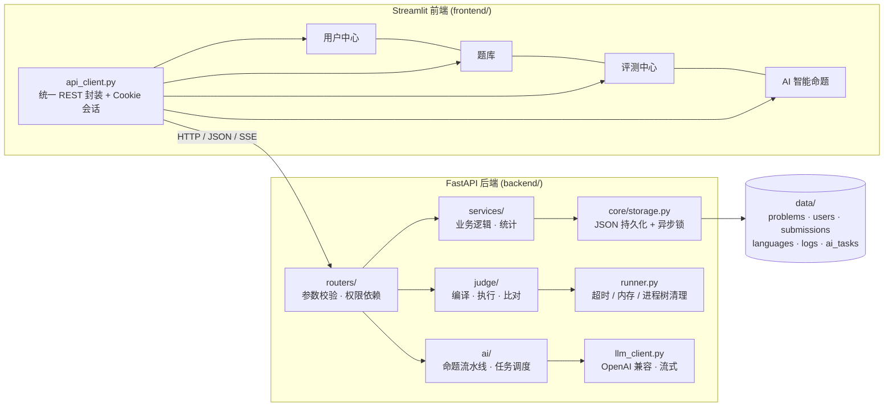

# 程序设计训练（Python）大作业实验报告

**项目名称**：Python OJ —— 小型 Online Judge 系统
**技术栈**：FastAPI（全异步）+ Pydantic v2 + Uvicorn + Streamlit + bcrypt + psutil + httpx
**代码规模**：后端约 3 500 行、前端约 1 000 行、测试约 1 000 行

---

## 一、系统功能与设计

### 1.1 总体架构

系统采用前后端分离架构：Streamlit 前端只通过 REST API 与后端交互，不直接读写任何数据文件；
后端内部按「路由层 → 服务层 → 存储层」分层，评测与 AI 命题在后台 asyncio 任务中异步执行。



### 1.2 模块划分与职责

| 模块 | 目录 | 职责 |
| --- | --- | --- |
| 应用装配 | `backend/app.py` | 中间件、异常处理器、路由注册、启动初始化 |
| 通用设施 | `backend/core/` | 统一响应、异常体系、JSON 存储、密码与会话、权限依赖、分页 |
| 数据模型 | `backend/models/problem.py` | 题目字段校验与默认值补全 |
| 业务服务 | `backend/services/` | 题目、用户、提交、语言、日志、统计 |
| 评测引擎 | `backend/judge/` | 进程执行、资源限制、输出比对、结果汇总 |
| AI 命题 | `backend/ai/` | 模型配置、LLM 客户端、命题流水线、任务调度 |
| 接口层 | `backend/routers/` | 6 个业务模块 + 系统接口 |
| 前端 | `frontend/` | 三组页面 + AI 命题页，统一 API 客户端 |
| 测试 | `tests/` | 端到端接口测试、前端冒烟测试、假模型服务 |

### 1.3 数据存储设计

采用「一题一文件 + 索引文件」的 JSON 方案，便于助教直接查看数据：

```
data/
├── problems/{problem_id}.json      # 题目配置（含测试点）
├── submissions/{submission_id}.json# 提交与逐测试点结果
├── users.json                      # 用户（密码为 bcrypt 哈希）
├── sessions.json                   # 服务端会话
├── languages.json                  # 语言注册表
├── access_logs.json                # 日志访问审计
├── ai_config.json                  # 模型配置（密钥加密）
├── ai_tasks.json                   # 命题任务快照
└── secret.key                      # 本地主密钥（600 权限，不入库）
```

写操作统一「先写临时文件 → `os.replace` 原子替换」，避免进程中断产生半个文件；
每个题目/提交有独立 `asyncio.Lock`，保证并发下的读-改-写安全。

### 1.4 权限矩阵

| 资源 | 未登录 | 普通用户 | 题目公开日志时 | 管理员 |
| --- | --- | --- | --- | --- |
| 题目列表/详情/新增/编辑 | 401 | ✅ | ✅ | ✅ |
| 删除题目 | 401 | 403 | 403 | ✅ |
| 提交评测 | 401 | ✅ | ✅ | ✅ |
| 查看提交详情/列表 | 401 | 仅本人 | 仅本人 | 全部 |
| 重新评测 | 401 | 403 | 403 | ✅ |
| 评测日志 | 401 | 仅本人（无明细） | 明细可见 | ✅ |
| 日志可见性配置 / 访问审计 | 401 | 403 | 403 | ✅ |
| 用户列表 / 角色变更 / 创建管理员 | 401 | 403 | 403 | ✅ |

---

## 二、关键实现与难点

### 2.1 难点一：状态码优先级与 FastAPI 参数校验顺序

**问题**：FastAPI 会先做请求体校验并返回 422，导致「未登录 + 参数错误」时返回 400 而非 401，
与 API 文档要求的 `401 > 403 > 400 > 429 > 409 > 404 > 500` 不符。

**解决**：
1. 把鉴权写进 `Depends`（`get_current_user` / `require_admin`）。FastAPI 求解依赖在请求体校验之前，
   依赖里抛出的 401/403 会立即生效，优先级天然正确；
2. 路由内不再依赖 FastAPI 自动校验，而是用 `read_json_body()` + Pydantic 手动解析，
   把 `ValidationError` 转成 400，彻底消灭 422；
3. 路由内部按优先级顺序显式检查：提交接口先校验参数（400）→ 限流（429）→ 检查题目/语言存在（404）。

### 2.2 难点二：跨平台资源限制与进程树清理

**问题**：`resource.setrlimit` 只在 POSIX 存在；Windows 上用户代码若派生孙进程，
只杀父进程会留下僵尸进程继续占用 CPU。

**解决**：
* 内存：统一用 `psutil` 每 20 ms 采样「进程 + 递归子进程」的 RSS 峰值，超限立即终止并判 `MLE`；
  POSIX 额外设置 `RLIMIT_CPU` / `RLIMIT_FSIZE` 兜底；
* 超时：`asyncio.wait_for` 超时后，Windows 用 `taskkill /F /T /PID`、POSIX 用 `os.killpg(SIGKILL)`
  杀整棵进程树；
* 输出：自定义流式读取，单测试点上限 4 MB，防止 `while True: print(...)` 撑爆内存。

### 2.3 难点三：动态注册语言的安全边界

任意登录用户都可以注册语言，等于让用户提交「要执行的命令」，属于典型的命令注入风险。

**解决**：
* 命令先切分为 argv 后直接 `exec`，**不经过 shell**，从根本上屏蔽 `;`、`|`、`` ` ``、`$()`；
* 首参数必须在编译器/解释器白名单内，显式禁止 `sh`/`bash`/`cmd`/`powershell`/`sudo`；
* `{src}` / `{exe}` / `{workdir}` 只能由服务端替换为受控临时目录的绝对路径；
* 限制命令长度、禁止换行与控制字符、校验占位符集合。

### 2.4 难点四：AI 命题如何真正「有用」

只让模型生成一段文本，属于文档中明确列出的反例。本项目把命题拆成六个阶段并**实际执行**
模型产物：

1. 需求分析 → 2. 题面生成 → 3. 标程 + 暴力解 → 4. 数据生成脚本 →
5. **真实运行**生成脚本得到输入、用标程产出期望输出、在小数据上与暴力解交叉验证 →
6. 输出可入库的完整配置。

其中第 5 步是关键：如果标程与暴力解在小数据上不一致，会把失败原因回灌给模型并重试（最多两轮），
这样生成的测试点既与题面自洽，又能真正区分不同复杂度的算法。

### 2.5 难点五：实时进度与「真中断」

* 进度：任务内部通过回调把「阶段/增量文本/用量」推入订阅队列，SSE 端点逐条下发；
* 中断：`PUT .../cancel` 调用 `task.cancel()`，取消的是**后台 asyncio 任务本身**，
  进行中的 `httpx` 流式请求会被一并取消，任务状态置为 `cancelled`；
  已结束的任务再次中断返回 409。

### 2.6 其他实现要点

* 密码使用 bcrypt（显式截断到 72 字节避免抛错）；
* 会话 ID 由 `uuid4` + 随机字节拼接，服务端存储、登出即失效、过期自动清理；
* 模型密钥用本地主密钥派生的密钥流加密后落盘，任何查询接口只返回 `api_key_configured`；
* 审计日志只记录「已登录且提交存在」的访问，未登录/参数错误不记录，与 API 文档一致。

---

## 三、成果展示与测试

### 3.1 自动化测试结果

| 测试 | 命令 | 结果 |
| --- | --- | --- |
| 端到端接口测试 | `python run.py test` | **228 / 228 通过** |
| 前端页面冒烟测试 | `python run.py test-frontend` | **11 / 11 通过** |
| 代码规范 | `python -m ruff check .` | **All checks passed** |

端到端测试会自行拉起真实 uvicorn 服务（临时数据目录 + 随机端口）和本地假模型服务，
不依赖任何外部网络。

### 3.2 评测判定覆盖

| 提交 | 期望 | 实测 |
| --- | --- | --- |
| `print(a+b)` | AC，得分 20/20 | ✅ |
| `print(-1)` | WA，得分 0/20 | ✅ |
| 第一个测试点正确、第二个错误 | 部分通过，得分 10/20 | ✅ |
| `print(1/0)` | RE | ✅ |
| `while True: pass` | TLE | ✅ |
| `def broken(:` | CE（编译信息 `result=failed`） | ✅ |
| 申请 1 GB 内存（限制 64 MB） | MLE | ✅ |
| C++ `cin >> a >> b` | AC（编译 `g++ -O2 -std=c++14`） | ✅ |

逐测试点结果通过 Step 5 的日志接口断言为 `["AC","AC"]`、`["AC","WA"]`、`["TLE","TLE"]` 等。

### 3.3 边界与异常测试

* 用户名 2 字符 / 密码 5 位 / 重复用户名 → 400；密码错误 → 401；banned 用户登录 → 403；
* 题目 id 含 `../`、缺字段、测试点元素缺 `output`、`time_limit` 超范围 → 400；重复 id → 409；
* `PUT /api/problems/{id}` 中 body 的 `id` 与路径不一致 → 400；题目不存在 → 404；
* 提交：缺参数 → 400、题目/语言不存在 → 404、1 分钟内第 4 次 → 429、未登录 → 401；
* 列表分页：一级条件全空 → 400、只给 `page` → 400、只给 `page_size` → 第一页；
* 越权：普通用户查看他人提交 → 403、删除题目 → 403、读取审计 → 403；
* 日志可见性：未公开时他人 403 且本人响应不含 `details`，公开后任意登录用户可见明细；
* 系统重置：未登录 → 401；重置后题目清空、语言恢复内置、仅剩初始管理员且可重新登录。

### 3.4 界面效果

前端共 4 个导航页，均通过 REST API 与后端交互：

| 页面 | 主要内容 |
| --- | --- |
| 用户中心 | 登录/注册/退出、个人信息、管理员用户列表与角色变更、创建管理员、后端地址设置 |
| 题库 | 题目列表、详情（含样例与完整配置）、新增、编辑、删除、日志可见性配置 |
| 评测中心 | 代码提交（提交后自动轮询）、提交记录筛选分页、提交详情、逐测试点日志、语言注册、重新评测 |
| AI 智能命题 | 模型配置、命题任务创建、SSE 实时进度、任务列表与中断、Token 用量与费用、一键导入题库 |

---

## 四、AI 使用说明

| 项目 | 内容 |
| --- | --- |
| 工具链 | DeepSeek Harness（命令行编码代理）+ deepseek-v4 系列模型；编辑器为 VS Code |
| 工作流 | 先由人工确定模块划分与接口契约（严格对齐 `API.md`），再由 AI 逐模块实现；每完成一个模块立即编写/运行测试，用 `ruff` 与端到端测试做质量门禁 |
| Vibe Coding 比例 | 本项目的代码几乎全部由 AI 在人工设计的架构约束下生成（约 95%），人工负责：确定分层与数据模型、审查关键逻辑（权限优先级、进程清理、命令白名单）、设计测试用例、判断结果是否符合 API 文档 |
| AI 参与的关键决策 | 六阶段命题流水线、用暴力解交叉验证测试数据、SSE + `task.cancel()` 的真中断方案、状态码优先级通过 `Depends` 实现 |
| 质量保证 | 228 项接口断言 + 11 项前端断言 + ruff 零告警；所有 AI 生成的关键代码都由人工逐段复核 |
| 说明 | 报告与代码内容一致，未直接复制任何外部项目源码；参考了课程文档与 FastAPI/Starlette/Streamlit 官方文档 |

---

## 五、总结与建议

### 收获

1. **异步编程**：理解了「把评测丢进 `asyncio.create_task` 后立刻返回」与
   「用 `asyncio.wait_for` + 进程树清理做资源限制」的组合，也踩到了
   「`await` 阻塞式调用会拖住事件循环」的坑，学会了用 `asyncio.to_thread` 包装文件 I/O。
2. **接口契约**：状态码优先级、分页语义、`{code,msg,data}` 统一结构这类细节，
   写文档时觉得琐碎，真正实现后才发现它们决定了系统的可用性。
3. **安全边界**：动态注册语言、用户代码执行、模型密钥存储，三处都必须在「功能」和「安全」之间
   做取舍，白名单 + 不用 shell 是最省心也最有效的做法。

### 时间投入

| 阶段 | 大致投入 |
| --- | --- |
| 需求梳理与接口契约 | 10% |
| 后端六个模块 | 45% |
| 评测引擎与跨平台适配 | 20% |
| 前端与接口对接 | 15% |
| 测试、文档与调试 | 10% |

### 改进建议

1. 存储换成 SQLite/PostgreSQL 后，列表分页与统计可以下推为 SQL，避免全量扫描 JSON；
2. 内存限制可以改用 cgroup（Linux）或 Job Object（Windows）获得精确的硬限制；
3. 评测队列可引入优先级与并发上限，避免大量提交同时抢占 CPU；
4. 前端可改为 `pages/` 多页结构并加入代码高亮与 Markdown 题面渲染；
5. AI 命题可进一步接入「运行暴力解卡时」的自动化分析，让模型根据实际 TLE 情况反推数据规模。
